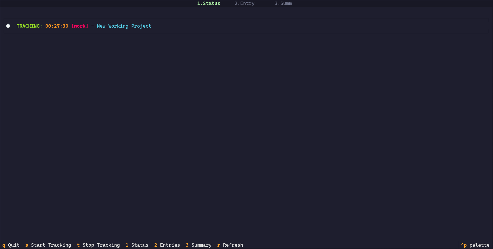
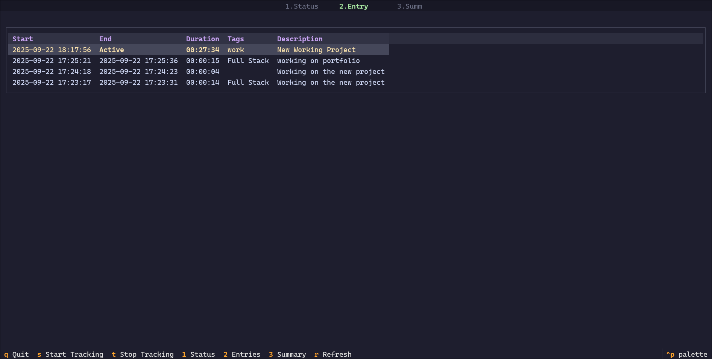
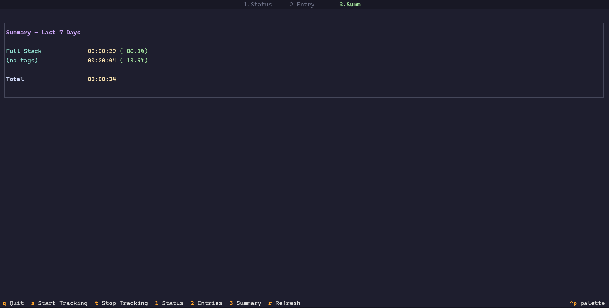

# ⏱️ Time Tracker TUI

A beautiful **Textual-based TUI Time Tracker** with **Catppuccin Mocha** colors and **Vim keybindings**, inspired by [Timewarrior](https://timewarrior.net/).

## ✨ Features
- Start/stop time tracking sessions
- Tags & descriptions
- Status view (active session)
- Entries view (history, delete support)
- Summary view (weekly breakdown with percentages)
- Catppuccin Mocha theme
- Vim-style keybindings (hjkl, gg/G, etc.)

## 📦 Installation
```bash
git clone https://github.com/yourusername/time-tracker-tui.git
cd time-tracker-tui
pip install -r requirements.txt
```
## 🚀 Usage
```bash
python time_tracker.py
```

## 🔤Keybindings
- s → Start tracking
- t → Stop tracking
- 1 → Status view
- 2 → Entries view
- 3 → Summary view
- d → Delete entry (in Entries view)
- q or Ctrl+C → Quit

## 🖼️ Screenshots





## 📄 License
MIT License
Copyright (c) 2025 YOUR NAME

Permission is hereby granted, free of charge, to any person obtaining a copy
of this software and associated documentation files...
MIT
